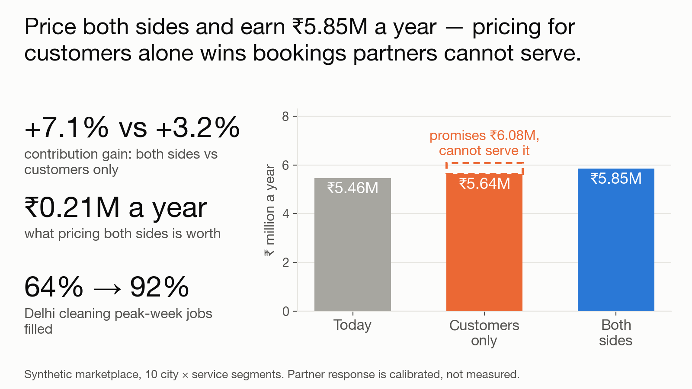
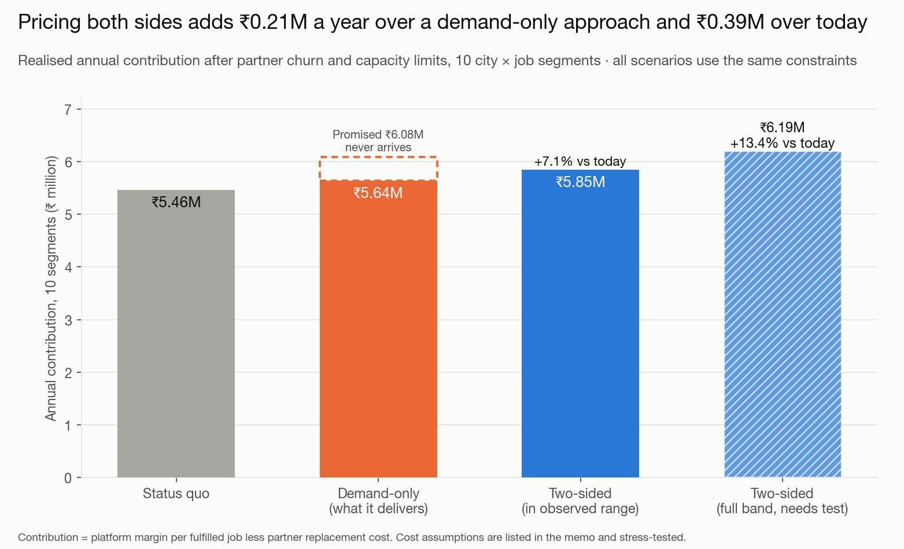
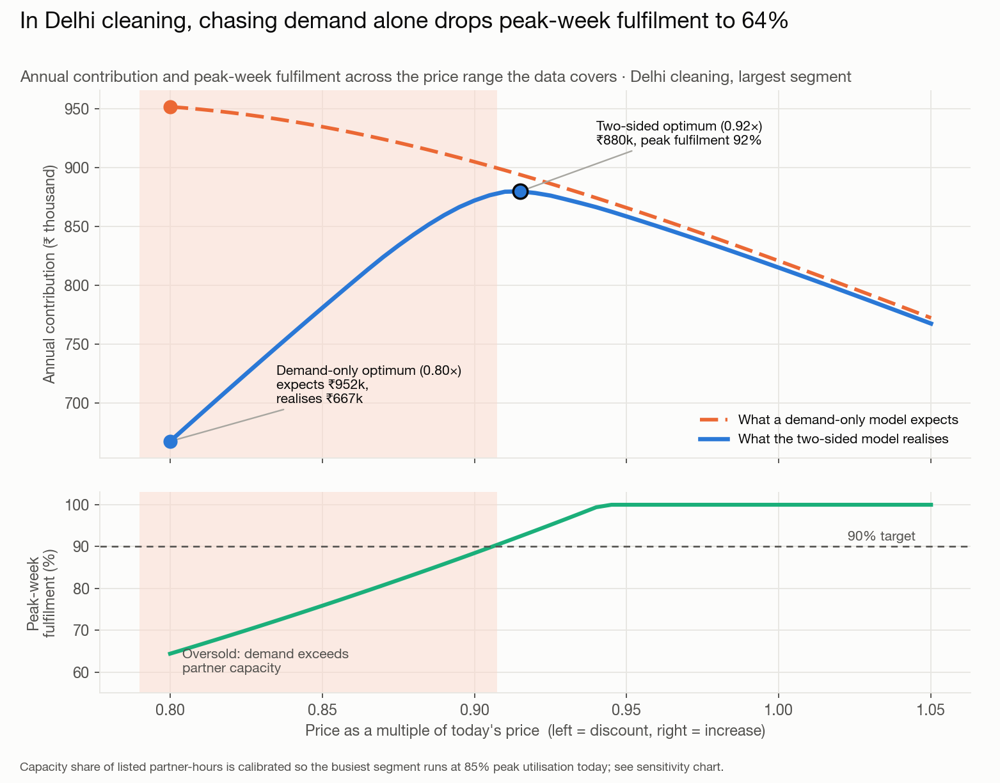
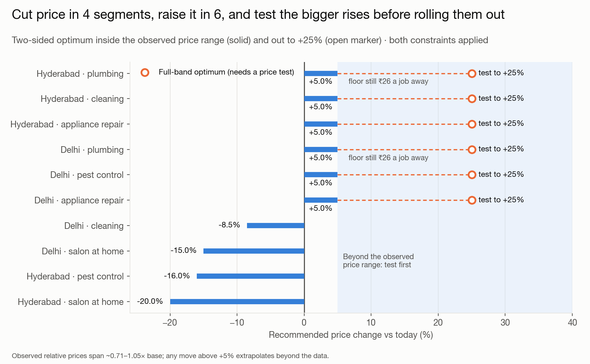
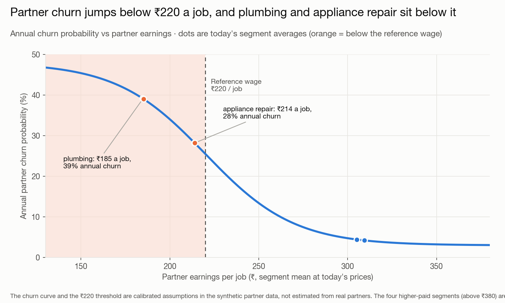
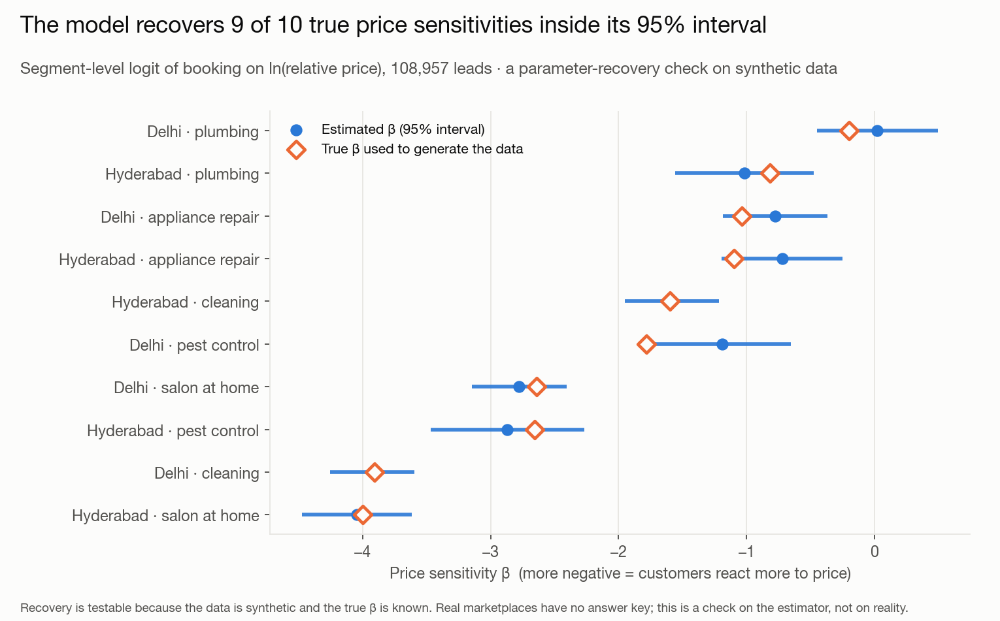
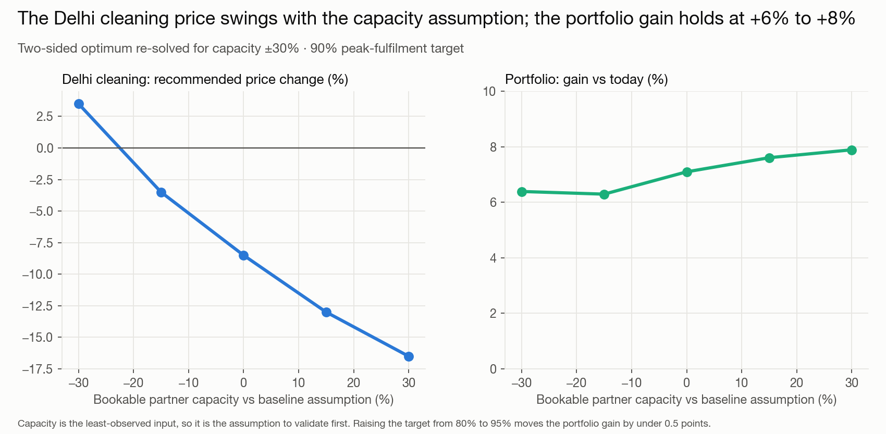

# Two-Sided Pricing Engine

**What price should a marketplace charge, when cutting it wins customers but starves the partners who do the work?**

- **Situation.** A home-services marketplace sells ten city-and-service combinations — cleaning in Delhi, plumbing in Hyderabad, and so on. Prices are set by hand, one at a time, and judged on whether customers book.
- **Task.** What price should each segment carry — and does it still make money once the partners who do the work decide whether the job is worth taking?
- **Action.** Built a model that prices both sides at once: how customers respond to price, how partner earnings and drop-off respond to that same price, then the best price per segment while partner pay stays above a floor and peak-week jobs stay above 90% filled.
- **Result.** **+7.1%** modelled annual contribution, ₹5.46M → ₹5.85M. Pricing for customers alone earns less than half of that: **+3.2%**.
- **The trade-off.** Four segments need price *rises* to clear the pay floor. Plumbing needs about **+19%**, outside what this data can vouch for — so it gets a staged test, not a rollout.

*Lived context, not a project output: I run a category P&L in a home-services marketplace, where the pull between customer price and partner earnings is a live weekly decision.*

> **Data and honesty**
> - All data is synthetic. Customer price response is calibrated on a public retail dataset.
> - The partner side — the ₹220-a-job reference wage, the drop-off curve — is simulated from assumptions I set, not measured.
> - Every number here is a model output, never production impact.

**[Read the one-page decision memo →](docs/DECISION_MEMO.md)**



*The whole decision in one picture. The three figures below repeat it as text.*

| | | |
|---|---|---|
| **+7.1%** | **₹0.21M / yr** | **64% → 92%** |
| more annual contribution than today, using only price moves this data supports | what pricing both sides is worth, over pricing for customer demand alone | peak-week jobs actually filled in Delhi cleaning: demand-only price vs two-sided |

---

## Why pricing one side fails



*Four ways to price the same ten segments. The demand-only bar promises the most and delivers less than the two-sided bar.*

- Price moves two things at once: **bookings**, which is what customers see, and **whether partners stay**, which is what they earn.
- Optimise for customers alone and you win bookings nobody can serve. Here that means cutting Delhi cleaning to **0.80×** today's price and lifting demand about **60%** — past what the partner base can cover.
- That plan **promises ₹6.08M and delivers ₹5.64M**. Pricing both sides delivers **₹5.85M**.
- **So what.** Pricing to the capacity edge beats chasing demand. The demand-only plan wins on a demand dashboard and loses in the P&L.

## Where the difference comes from: Delhi cleaning



*The gap between the two lines is the cost of believing a demand curve past the point where partners run out.*

- Below about **0.91×** today's price, extra demand outruns partner capacity.
- Fulfilment drops under the **90%** target, and money actually earned falls — while the demand-only view keeps climbing.
- The two-sided best price is **0.915×**, a cut of **8.5%**: still a real discount, but one the partner base can serve.
- **So what.** The optimum sits at the capacity edge, not at the bottom of the demand curve.

## What to do



*Recommended move per segment. Bars inside the shaded band are moves the observed price range already covers; the rest need a test.*

| | Move now (inside the range the data covers) | Then |
|---|---|---|
| **Cut**: Delhi cleaning, Delhi and Hyderabad salon at home, Hyderabad pest control | −8.5% to −20% | nothing further: these best prices are already inside the data |
| **Raise**: plumbing, appliance repair, Delhi pest control, Hyderabad cleaning | +5% | **test** larger rises, up to +25%, before trusting them |

- Four segments — plumbing and appliance repair, in both cities — pay partners **below the ₹220-a-job reference wage** today.
- **28–39%** of those partners are modelled to leave within a year.
- For them a price rise is a win on both sides: customers pay more, partners stay. Not a trade-off.
- Appliance repair clears the pay floor at **+5%**. Plumbing needs about **+19%**, which this data cannot vouch for.
- **So what.** Where partners are underpaid, raising price is the retention lever, not the risk.



*The partner side of the same price. Below roughly ₹220 a job, partners start leaving faster than bookings arrive.*

The full recommendation table — per-segment drop-off, fulfilment and contribution — is in the **[decision memo](docs/DECISION_MEMO.md)**.

## How much to trust it



*A marking exercise: the synthetic data was built with a known true answer per segment, so the estimates can be scored against it.*

- **Does it find the right answer?** The data was built with a known "true" price sensitivity per segment, so the model can be marked against it. It gets **9 of 10** right, off by **0.21** on average.
- **Is a fancier model better?** No. Gradient boosting does no better on weeks held back from training, so the simple, explainable model costs nothing in accuracy.
- **Does it invent things?** No. Handed a promotion effect that does not exist in the data, it correctly reports finding none.
- **Would the advice survive a different draw?** Re-drawing every price sensitivity from its own uncertainty **400 times**, every recommended move keeps its direction in at least **99%** of draws.



*What breaks the answer: capacity. The overall gain is robust; the price for the tightest segment is not.*

- **What would change the answer?** Partner capacity, and little else.
- Move bookable capacity **±30%** and the Delhi cleaning price ranges from **−17% to +3%** — because when capacity is tight, price is what rations it.
- The portfolio gain barely moves: **+6% to +8%**.
- **So what.** Capacity is the least-observed input here and the first thing to validate with real data.

## What this does not show

- **Partner response is calibrated, not estimated.** The drop-off curve and the ₹220 threshold were built into the synthetic data by me. Real partner behaviour must be measured before acting on the partner side.
- **The demand sensitivities are a plausible range, not a measured elasticity.** Their spread was calibrated from a price-and-volume pattern in UCI Online Retail II, where unit price partly reflects who is buying and how much.
- **Cost inputs are assumptions:** non-partner variable cost at 10% of base price, ₹3,000 to replace a partner, 85% peak utilisation in the busiest segment, a 90% fulfilment target, a 65% partner take rate.
- **Anything outside the observed price range needs a test.** Observed prices span about 0.71–1.05× base; the full-band gain (+13.4%) needs experiments, not trust.
- **No cross-price or promotion effects.** This data has none, so those live in the [promotion project](https://github.com/akash-sood97/promotion-cannibalisation-engine), on real retail data.
- **No causal claim.** These are conversion responses from randomised-price synthetic leads, not evidence about any real marketplace.

## Terms, in plain English

<details>
<summary>Six terms this project leans on</summary>

- **Contribution** — what is left from a booking after the costs that scale with it: the partner's pay and the cost of serving the job. Not profit; it ignores fixed overhead.
- **Price sensitivity (elasticity)** — how much demand moves when price moves. High sensitivity means a small cut buys a lot of bookings; low sensitivity means it mostly just costs margin.
- **Fulfilment** — the share of jobs customers asked for that a partner actually turned up for. Cutting price can win bookings the partner base cannot serve, and that shows up here.
- **Partner earnings floor** — a minimum per-job payout, below which partners start leaving. It is the constraint that makes this a two-sided problem instead of a demand curve.
- **Held-back weeks (holdout)** — weeks hidden from the model while it learns, then used to check it. A model that only looks good on data it has already seen has proved nothing.
- **Placebo test** — asking the model to find an effect known not to exist. Finding nothing is the pass condition: it shows the model is not inventing patterns.

</details>

## Try it

```bash
pip install -r requirements.txt
python data/generate.py              # rebuild the synthetic data (downloads the ~44 MB UCI proxy once)
python analysis/run_analysis.py      # fit, optimise, write outputs/, figures/, docs/DECISION_MEMO.md
streamlit run app/streamlit_app.py   # price-band explorer: move the assumptions, watch the answer change
```

Every number in the figures and the memo is computed by `analysis/run_analysis.py`, not typed by hand.

## Repo layout

```
src/          elasticity.py (demand model) · economics.py (two-sided engine, optimiser) · viz.py · data generators
analysis/     run_analysis.py
app/          streamlit_app.py
data/         generate.py · processed/ (committed) · generation_report.md
outputs/      CSVs behind every chart · summary.json
figures/      the six charts above
docs/         DECISION_MEMO.md · method spec · problem framing
notebooks/    00_data_generation_and_proxy.ipynb (how the synthetic data is built)
```

**Author:** Akash Sood · ISB AMPBA · [portfolio](https://akash-sood97.github.io) · [GitHub](https://github.com/akash-sood97)

*Data: demand calibrated on [UCI Online Retail II](https://archive.ics.uci.edu/dataset/502/online+retail+ii) (CC BY 4.0); everything else simulated.*
